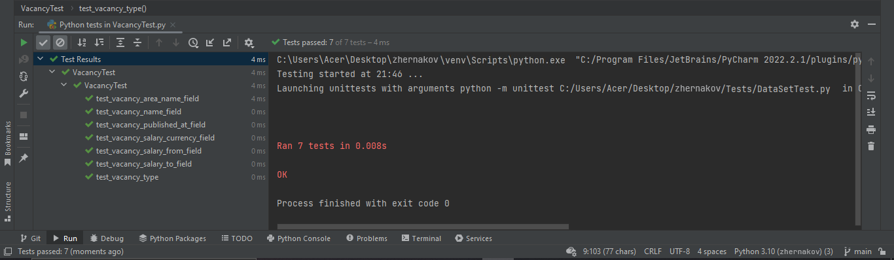

# Отчет о тестировании

# Отчет о замерах
### Время выполнения скрипта: 0:01:17

### Время выполнения скрипта: 0:00:57

### Время выполнения скрипта: 0:00:22

### Время выполнения скрипта без профилирования

# Результат деления файла vacancies_by_year.csv

# Отчет о замерах
## Без многопроцессорной обработки - 6.17 сек

## Multiprocessing - 5.34 сек

## Concurrent futures - 4.25

